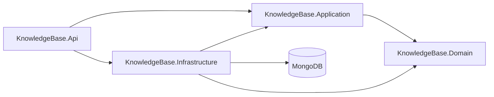
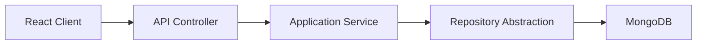

# Knowledge Base App

A knowledge base API built with ASP.NET Core and MongoDB, designed to be consumed by a React frontend running in the browser.

## Overview

The application allows authenticated users to:

- sign up and log in
- manage their own notes
- search and organize notes
- keep long-lived browser sessions through access-token refresh

## Architecture

The backend follows a layered architecture with Clean Architecture principles.

- `KnowledgeBase.Api`: HTTP transport layer, controllers, request/response contracts, auth middleware setup
- `KnowledgeBase.Application`: use cases, DTOs, validation, and service orchestration
- `KnowledgeBase.Domain`: core entities and repository abstractions
- `KnowledgeBase.Infrastructure`: MongoDB persistence, JWT generation, password hashing, refresh-token support
- `KnowledgeBase.Application.UnitTests`: unit tests using `xUnit` and `NSubstitute`

### Dependency Direction



### Request Flow



## Authentication and Sessions

The API uses JWT access tokens plus refresh sessions.

- access tokens are short-lived and sent in the `Authorization: Bearer <token>` header
- refresh tokens are long-lived and stored server-side as hashed values in the `refreshSessions` collection
- the browser receives the refresh token through an `HttpOnly` cookie
- the React frontend should call auth endpoints with `credentials: 'include'`
- refresh-token rotation is used, so each refresh invalidates the previous refresh token
- access tokens also carry a user `SecurityStamp`, so tokens issued before a password reset become invalid

### Auth Endpoints

| Method | Endpoint | Description |
| --- | --- | --- |
| `POST` | `/api/auth/signup` | Create a new user |
| `POST` | `/api/auth/login` | Return an access token and set refresh-token cookie |
| `POST` | `/api/auth/refresh` | Rotate refresh token and return a new access token |
| `POST` | `/api/auth/logout` | Revoke refresh session and clear refresh-token cookie |
| `POST` | `/api/auth/reset-password` | Change the current user's password, revoke all sessions, and clear the refresh-token cookie |

### Password Reset Behavior

`POST /api/auth/reset-password` requires authentication and expects:

```json
{
  "currentPassword": "OldPassword123!",
  "newPassword": "NewPassword123!"
}
```

On success, the API:

- verifies the current password
- stores the new password as a hash
- rotates the user's `SecurityStamp`
- revokes all active refresh sessions for that user
- clears the refresh-token cookie

Because access tokens are validated against the current `SecurityStamp`, any previously issued access token stops working after the password reset. The user must log in again with the new password.

## Notes and Ownership

Notes are user-owned.

- each note stores a `UserId`
- the API reads the authenticated user id from JWT claims
- all note queries are filtered by both `note.Id` and `note.UserId` when relevant
- a user can only read, search, update, patch, or delete their own notes
- if a user requests another user's note id, the API returns `404`

### Notes Endpoints

All note endpoints require authentication.

| Method | Endpoint | Description |
| --- | --- | --- |
| `POST` | `/api/notes` | Create a note for the current user |
| `GET` | `/api/notes` | Get all notes for the current user |
| `GET` | `/api/notes/{id}` | Get a single owned note |
| `GET` | `/api/notes/search?q=` | Search only the current user's notes |
| `PUT` | `/api/notes/{id}` | Fully update an owned note |
| `PATCH` | `/api/notes/{id}` | Partially update an owned note |
| `DELETE` | `/api/notes/{id}` | Delete an owned note |

## Core Technologies

- `.NET 10`
- `ASP.NET Core Web API`
- `MongoDB`
- `FluentValidation`
- `JWT Bearer Authentication`
- `xUnit`
- `NSubstitute`

## Configuration

The API reads configuration from `appsettings.json`, `appsettings.Development.json`, environment variables, or user secrets.

### Required Settings

```json
{
  "MongoDb": {
    "ConnectionString": "mongodb+srv://<user>:<password>@cluster.mongodb.net/",
    "DatabaseName": "knowledgeapi",
    "NotesCollectionName": "notes",
    "UsersCollectionName": "users",
    "RefreshSessionsCollectionName": "refreshSessions"
  },
  "Jwt": {
    "Issuer": "KnowledgeBase.Api",
    "Audience": "KnowledgeBase.Client",
    "SecretKey": "a-long-random-secret",
    "ExpirationMinutes": 60
  },
  "RefreshToken": {
    "ExpirationDays": 7,
    "TokenByteLength": 32,
    "CookieName": "kb.refreshToken",
    "CookieSameSite": "Lax",
    "CookieHttpOnly": true,
    "CookieSecure": false
  }
}
```

### Recommended Secret Management

```powershell
cd src/KnowledgeBase.Api
dotnet user-secrets init
dotnet user-secrets set "MongoDb:ConnectionString" "your_connection_string"
dotnet user-secrets set "Jwt:SecretKey" "your_long_random_secret"
```

## Running the API

```powershell
dotnet restore
dotnet run --project src/KnowledgeBase.Api
```

Swagger is available when running in Development.

## Testing

Run the unit tests with:

```powershell
dotnet test KnowledgeBase.slnx
```

Current unit coverage focuses on:

- note service behavior
- auth service behavior
- reset-password auth behavior
- request validation rules

## Frontend Integration Notes

For a React browser client:

- call `login`, `refresh`, and `logout` with `credentials: 'include'`
- keep the access token in memory, not local storage
- use the `RefreshAfterUtc` value from login/refresh responses to trigger silent refresh before expiry
- on a `401`, attempt one refresh and then retry the original request once
- if `reset-password` succeeds, clear any in-memory access token and redirect the user to log in again

## Solution Layout

```text
src/
  KnowledgeBase.Api
  KnowledgeBase.Application
  KnowledgeBase.Domain
  KnowledgeBase.Infrastructure

tests/
  KnowledgeBase.Application.UnitTests
```

## License

This project is licensed under the MIT License.
