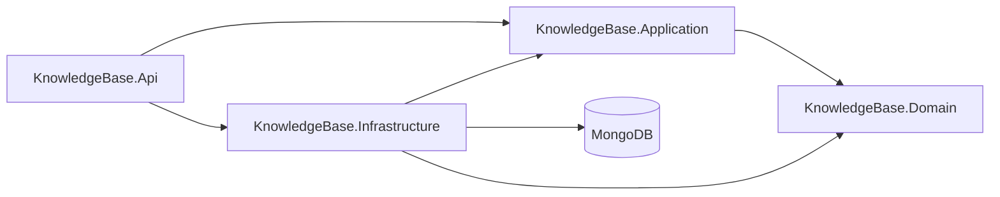
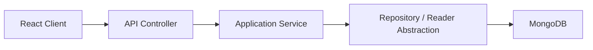

# Knowledge Base App

A knowledge base API built with ASP.NET Core and MongoDB, designed to be consumed by a React frontend running in the browser.

## Overview

The application allows authenticated users to:

- sign up and log in
- manage their own notes
- search and organize notes
- keep long-lived browser sessions through access-token refresh

## Architecture

The backend follows a layered architecture with Clean Architecture principles.

- `KnowledgeBase.Api`: HTTP transport layer, controllers, request/response contracts, auth middleware setup
- `KnowledgeBase.Application`: use cases, DTOs, validation, and service orchestration
- `KnowledgeBase.Domain`: core entities, entity behavior, and repository abstractions
- `KnowledgeBase.Infrastructure`: MongoDB persistence, Mongo query readers, JWT generation, password hashing, refresh-token support
- `KnowledgeBase.Application.UnitTests`: unit tests using `xUnit` and `NSubstitute`

### Dependency Direction



### Request Flow



### Read And Write Split

The backend now uses the same read/write split pattern for users and notes:

- write operations use repositories and work with domain entities
- read operations use dedicated readers
- readers project Mongo documents directly into DTOs
- application services return those projected DTOs without remapping them in memory

### Domain Behavior

The domain layer is no longer just passive data classes.

- `Note` owns its normalization and update rules
- `User` owns username/email normalization and security-stamp/password state transitions
- application services orchestrate use cases, but the low-level business rules for entity state live closer to the entities themselves

This keeps services smaller and makes entity behavior easier to test and reason about.

### API Mapping

The API layer uses centralized mapping extensions instead of controller-local mapping methods.

- request contracts are converted to application DTOs in one place
- application DTOs are converted to API response contracts in one place
- controllers stay focused on HTTP concerns, authorization, and orchestration

Current mapping entry point:

- `ApiContractMappingExtensions`

### Controller Base

Authenticated controllers share a small controller base for common user-context handling.

- current user id lookup is centralized
- the standard unauthorized response for missing user identity is reused consistently

This removes repeated claim-parsing boilerplate from controllers like `AuthController` and `NotesController`.

Current examples:

- notes:
  - `INoteRepository` for writes and entity-based updates
  - `INoteReader` for `NoteDto` projection
- users:
  - `IUserRepository` for writes and auth/entity-based access
  - `IUserReader` for `UserListItemDto` projection

## Authentication and Sessions

The API uses JWT access tokens plus refresh sessions.

- access tokens are short-lived and sent in the `Authorization: Bearer <token>` header
- refresh tokens are long-lived and stored server-side as hashed values in the `refreshSessions` collection
- the browser receives the refresh token through an `HttpOnly` cookie
- the React frontend should call auth endpoints with `credentials: 'include'`
- refresh-token rotation is used, so each refresh invalidates the previous refresh token
- access tokens also carry a user `SecurityStamp`, so tokens issued before a password reset become invalid
- all API endpoints use the `v1` route convention, for example `/api/v1/auth/login` and `/api/v1/notes`

### Auth Endpoints

| Method | Endpoint | Description |
| --- | --- | --- |
| `POST` | `/api/v1/auth/signup` | Create a new user |
| `POST` | `/api/v1/auth/login` | Return an access token and set refresh-token cookie |
| `POST` | `/api/v1/auth/refresh` | Rotate refresh token and return a new access token |
| `POST` | `/api/v1/auth/logout` | Revoke refresh session and clear refresh-token cookie |
| `GET` | `/api/v1/auth/sessions` | List the current user's known sessions/devices |
| `POST` | `/api/v1/auth/logout-all` | Revoke all current sessions for the current user |
| `POST` | `/api/v1/auth/reset-password` | Change the current user's password, revoke all sessions, and clear the refresh-token cookie |
| `GET` | `/api/v1/auth/audit?limit=20` | Return recent auth/security events for the current user |

### Password Reset Behavior

`POST /api/v1/auth/reset-password` requires authentication and expects:

```json
{
  "currentPassword": "OldPassword123!",
  "newPassword": "NewPassword123!"
}
```

On success, the API:

- verifies the current password
- stores the new password as a hash
- rotates the user's `SecurityStamp`
- revokes all active refresh sessions for that user
- clears the refresh-token cookie

Because access tokens are validated against the current `SecurityStamp`, any previously issued access token stops working after the password reset. The user must log in again with the new password.

## Notes and Ownership

Notes are user-owned.

- each note stores a `UserId`
- the API reads the authenticated user id from JWT claims
- all note queries are filtered by both `note.Id` and `note.UserId` when relevant
- a user can only read, search, update, patch, or delete their own notes
- if a user requests another user's note id, the API returns `404`
- note reads are projected directly from Mongo into `NoteDto`

### Notes Endpoints

All note endpoints require authentication.

| Method | Endpoint | Description |
| --- | --- | --- |
| `POST` | `/api/v1/notes` | Create a note for the current user |
| `GET` | `/api/v1/notes` | Get all notes for the current user |
| `GET` | `/api/v1/notes/{id}` | Get a single owned note |
| `GET` | `/api/v1/notes/search?q=` | Search only the current user's notes |
| `PUT` | `/api/v1/notes/{id}` | Fully update an owned note |
| `PATCH` | `/api/v1/notes/{id}` | Partially update an owned note |
| `DELETE` | `/api/v1/notes/{id}` | Delete an owned note |

## Observability

The API includes a small built-in observability baseline:

- structured JSON console logging
- per-request correlation ids
- auth/security event logs
- health endpoints for liveness and readiness

### Correlation Header

Every response includes an `X-Correlation-Id` header.

- if the client sends `X-Correlation-Id`, the API reuses it
- otherwise the API generates one
- the same value is added to the logging scope so request logs and auth/security logs can be tied together

### Health Endpoints

| Method | Endpoint | Description |
| --- | --- | --- |
| `GET` | `/health` | Overall application health summary |
| `GET` | `/health/live` | Liveness probe for the API process |
| `GET` | `/health/ready` | Readiness probe for API + MongoDB |

Example readiness response:

```json
{
  "status": "Healthy",
  "totalDuration": 12.34,
  "entries": {
    "self": {
      "status": "Healthy",
      "description": "API is running.",
      "duration": 0.12,
      "error": null
    },
    "mongo": {
      "status": "Healthy",
      "description": "MongoDB is reachable.",
      "duration": 12.22,
      "error": null
    }
  }
}
```

### Monitoring Note

For deployment:

- use `/health/live` as a liveness probe so the platform only checks whether the API process is alive
- use `/health/ready` as a readiness probe so traffic is only sent to instances that can also reach MongoDB
- alert on repeated non-healthy `/health/ready` responses, because those usually indicate a database connectivity or startup issue rather than a simple request-level failure

## API Versioning

The API uses versioned routes under `v1`.

Examples:

- `/api/v1/auth/login`
- `/api/v1/auth/logout-all`
- `/api/v1/notes`
- `/api/v1/admin/users`

The API also returns:

```text
api-supported-versions: 1.0
```

This gives the frontend a stable and explicit route convention for client integrations.

## Core Technologies

- `.NET 10`
- `ASP.NET Core Web API`
- `MongoDB`
- `FluentValidation`
- `JWT Bearer Authentication`
- `xUnit`
- `NSubstitute`

## Configuration

The API reads configuration from `appsettings.json`, `appsettings.Development.json`, environment variables, or user secrets.

### Required Settings

```json
{
  "MongoDb": {
    "ConnectionString": "mongodb+srv://<user>:<password>@cluster.mongodb.net/",
    "DatabaseName": "knowledgeapi",
    "NotesCollectionName": "notes",
    "UsersCollectionName": "users",
    "RefreshSessionsCollectionName": "refreshSessions"
  },
  "Jwt": {
    "Issuer": "KnowledgeBase.Api",
    "Audience": "KnowledgeBase.Client",
    "SecretKey": "a-long-random-secret",
    "ExpirationMinutes": 60
  },
  "RefreshToken": {
    "ExpirationDays": 7,
    "TokenByteLength": 32,
    "CookieName": "kb.refreshToken",
    "CookieSameSite": "Lax",
    "CookieHttpOnly": true,
    "CookieSecure": false
  }
}
```

### Recommended Secret Management

```powershell
cd src/KnowledgeBase.Api
dotnet user-secrets init
dotnet user-secrets set "MongoDb:ConnectionString" "your_connection_string"
dotnet user-secrets set "Jwt:SecretKey" "your_long_random_secret"
```

## Running the API

```powershell
dotnet restore
dotnet run --project src/KnowledgeBase.Api
```

Swagger is available when running in Development.

## Testing

Run the unit tests with:

```powershell
dotnet test KnowledgeBase.slnx
```

Run the integration tests with:

```powershell
dotnet test tests/KnowledgeBase.Api.IntegrationTests
```

Current unit coverage focuses on:

- note service behavior
- auth service behavior
- reset-password auth behavior
- domain-backed note/user normalization behavior through service tests
- request validation rules

There is also API integration coverage for:

- `v1` route availability
- health endpoints
- correlation-id response behavior

## Frontend Integration Notes

For a React browser client:

- call `login`, `refresh`, and `logout` with `credentials: 'include'`
- keep the access token in memory, not local storage
- use the `RefreshAfterUtc` value from login/refresh responses to trigger silent refresh before expiry
- on a `401`, attempt one refresh and then retry the original request once
- if `reset-password` succeeds, clear any in-memory access token and redirect the user to log in again

## Solution Layout

```text
src/
  KnowledgeBase.Api
  KnowledgeBase.Application
  KnowledgeBase.Domain
  KnowledgeBase.Infrastructure

tests/
  KnowledgeBase.Application.UnitTests
  KnowledgeBase.Api.IntegrationTests
```

## License

This project is licensed under the MIT License.
